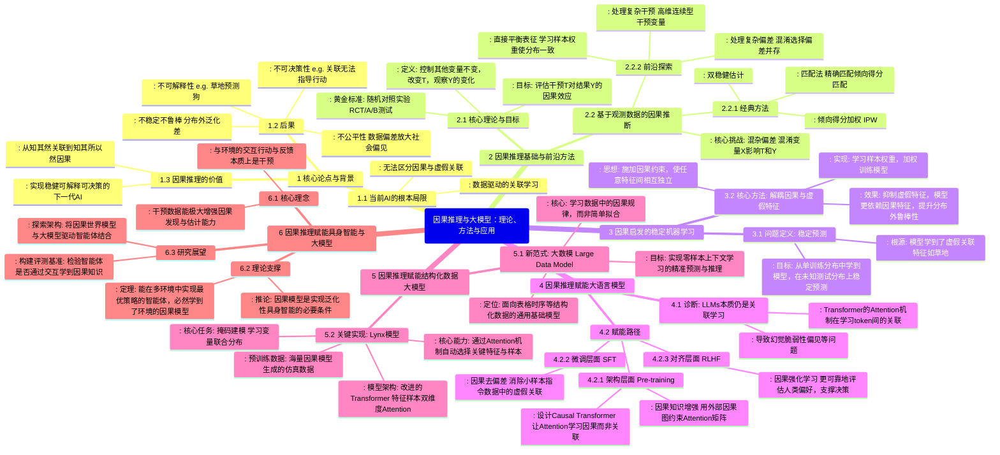

# 因果推理与大模型：理论、方法与应用

本报告系统探讨因果推理与通用大模型的交叉前沿，从理论到实践全面解析如何通过因果机制解决当前AI的核心问题。

## 思维导图总览

## 报告要点总结

### 一、核心问题
当前人工智能（包括大语言模型）本质上是**数据驱动的关联学习**，无法区分因果关联与虚假关联，导致模型存在不可解释、不可决策、不稳定、不公平等问题。

### 二、解决方案
通过引入**因果推理机制**，从关联学习跃升至因果学习，构建新一代可信AI系统。

### 三、三大应用方向
1. **语义空间**：因果赋能大语言模型
2. **数据空间**：因果赋能结构化数据大模型
3. **物理空间**：因果赋能具身智能体

## 参考资料
- 2025中国计算机大会（CNCC 2025）学术报告
- 报告人：邝老师（浙江大学）、张新璇（清华大学）、王昊天（国防科技大学）
